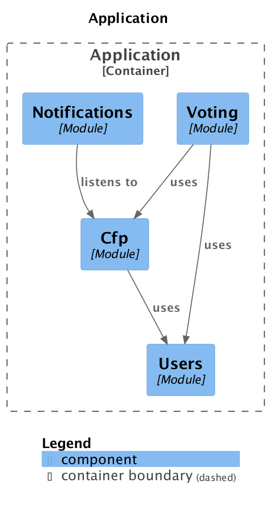

# Step 2: Meet the project

## C4 Model

## Rest reference in http format

Rest reference and requests in http format:

* [Proposals](../documentation/http/proposals.http)
* [Tickets](../documentation/http/tickets.http)
* [Users](../documentation/http/users.http)
* [Votes](../documentation/http/votes.http)

## Rest reference in curl format

Rest reference and requests in curl format:

* [Proposals](../documentation/proposals.md)
* [Tickets](../documentation/tickets.md)
* [Users](../documentation/users.md)
* [Votes](../documentation/votes.md)
